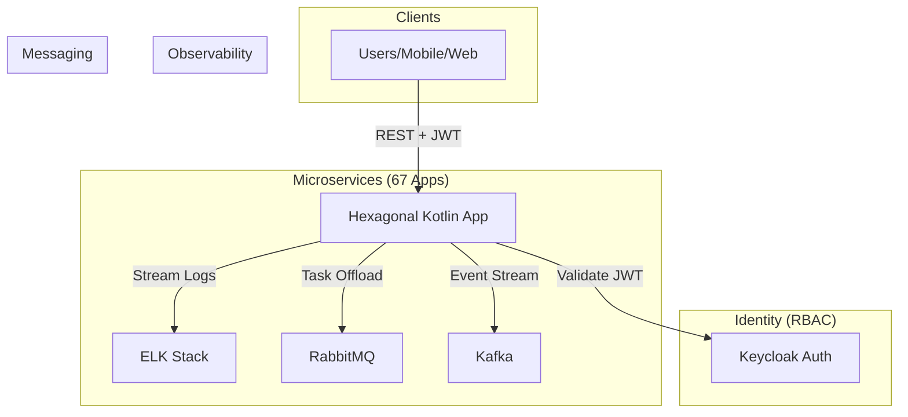

# ⭐️ [Please Star this Repo!](https://github.com/oludayoadeoye/kotlin-spring-67-enterprise-portfolio)
# Kotlin/Spring Boot 67-Project Enterprise Portfolio

## 🚀 The Mission: Scalable Enterprise Engineering
This portfolio showcases a 67-service ecosystem built with **Spring Boot 3.4.3**, **Java 21**, and **Kotlin 1.9.25**. The goal was to move beyond simple CRUD and implement a production-ready backbone capable of handling high-concurrency financial and AI workloads.

## 🏗️ The Production Standard: 4 Pillars of Quality
Every project in this branch has been refactored to meet an enterprise "Gold Standard":

### 1. Hexagonal Architecture (Clean)
*   **Separation**: Business logic is isolated in the `domain` layer with zero framework dependencies.
*   **Ports & Adapters**: Infrastructure (JPA, Flyway) and Application (REST) layers communicate via interfaces, allowing the database or API layer to be swapped without touching logic.

### 2. Modern Concurrency: Coroutines + Virtual Threads
*   **Non-blocking**: All services and controllers use Kotlin `suspend` functions.
*   **Efficiency**: Java 21 **Virtual Threads** are enabled. I used `withContext(Dispatchers.IO)` for blocking JPA calls to ensure the underlying carrier threads are never starved.

### 3. Identity & Security (OWASP Top 10)
*   **Centralized RBAC**: Integrated **Keycloak** via Docker. Every app acts as an OAuth2 Resource Server.
*   **Hardening**: Standardized security configs enforce CSP, HSTS, and Frame-Options to block XSS and Clickjacking.

### 4. Financial Integrity (Idempotency)
*   **Consistency**: Financial apps (e.g., `expense-tracker`) implement an `X-Idempotency-Key` pattern.
*   **Persistence**: Handled via **Flyway** managed migrations (`V1__init.sql`).

## 🧠 Deep Insights: Lessons Learned
*   **The Virtual Thread Pinning Trap**: During implementation, I encountered "carrier thread pinning" when using `synchronized` blocks. I replaced these with `ReentrantLock` to allow Virtual Threads to unmount during I/O.
*   **Spring AI Evolution**: Integrating Google Gemini required navigating the rapidly changing Spring AI milestones. I settled on the **Google Cloud Vertex AI SDK** for the most stable, enterprise-grade integration.
*   **Messaging Choice**: I chose **Kafka** for high-throughput streams (Stock Market) and **RabbitMQ** for reliable task offloading (AI/Speech Recognition) to demonstrate mastery of both streaming and queuing patterns.

## 🛠️ Infrastructure Backbone
Run the following in the root to launch the entire ecosystem support:
```bash
docker-compose -f docker-compose-infra.yml up -d
```
Includes: Keycloak, ELK Stack (ES/Logstash/Kibana), Kafka, and RabbitMQ.

## 📊 High-Level Architecture


